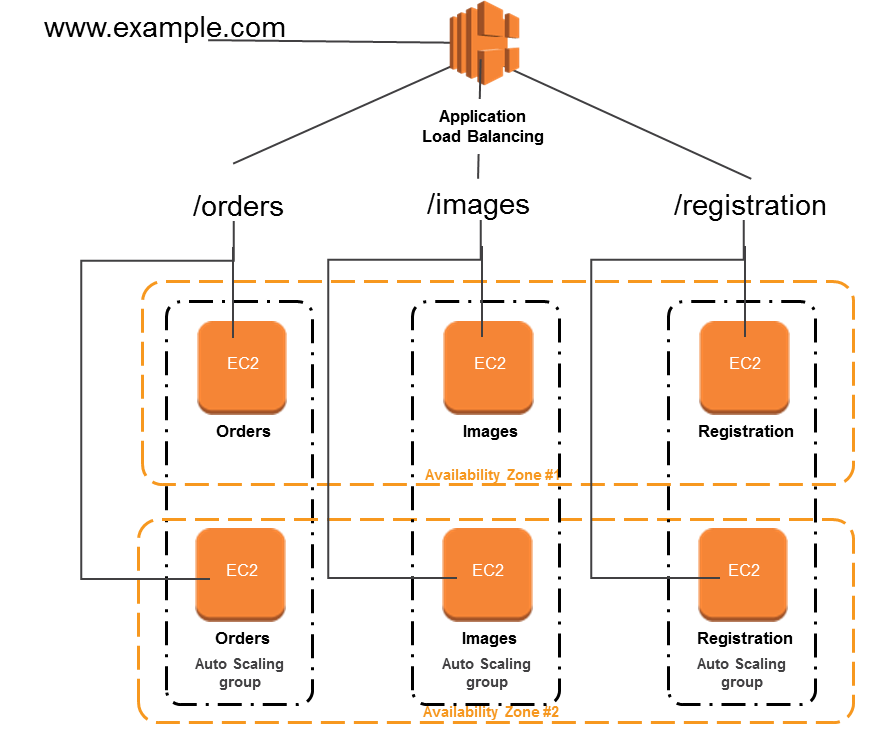

# aws-gems
This repository will be used for quick solutions of common problems faced in AWS world. 

## Micro-services based architecture - Multiple Services and service discovery
This is a common pattern where a thin client UI calls REST web services over HTTP/HTTPs. Services can call each other as well. There multiple way to architect this however the most common is to create self-contained web services where each is highly available or even better load balanced. A service discovery component is created to enable services to call each other. An API gateway can also be added to the mix.   I am showing an example architecture using application load balancer and path based routing. Refer to the diagram below. 

### CloudFormation Template Vs Elastic Bean Stalk
EBS is a convenient way to create a web application using a click through console however it does not work for this architecture. The architecture needs multiple web applications deployed on different EC2s and an ALB fronting them. Each application deployed on EC2 will be part of a target group. ALB will route the request to right target group based on the URL path. This will be governed by ALB listener rules. The approach needs two set of application codes to be deployed. EBS approach does not support this. EBS allows one set of application deployable to be uploaded, hence EBS approach can not be used to achieve this architecture. 
 
#### CloudFormation Template
  In this approach an Application Load balancer is created with default listener and target group. Then each web service is created as highly available and fault tolerant. Autoscaling group and launch configuration ensures high availability and fault tolerance. The services registers itself to a target group. For this target group a listener rule is added to the listener of the application load balancer.   It is easier to do this in a single template , however that would become unmanageable and service deployment would be tightly coupled with that of application load balancer. A better approach would be to decouple the deployment of ALB from deployment of web services.
 Refer the link below for more details on this approach- 
- [Multiple Services and service discovery](micro-services-service-discovery/README.md)

